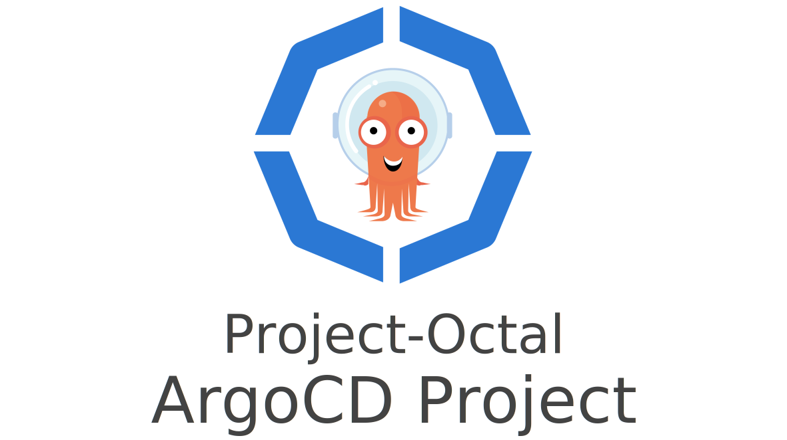

---

A Terraform module for provisioning and configuring ArgoCD projects.
This module can be used with or without the Project-Octal [terraform-kubernetes-argocd](https://github.com/project-octal/terraform-kubernetes-argocd) module.
The only hard requirement is a Kubernetes cluster with a functioning ArgoCD deployment.

---

***Note:*** This repository has been renamed from `terraform-argocd-project` to `terraform-kubernetes-argocd-project`
 to better follow the [Terraform module naming convention](https://www.terraform.io/docs/registry/modules/publish.html). 

--- 

### TODO:
- Update the Terraform version to 1.0+
- Deprecate the `k8s` provider in favor of the `kubernetes_manifest` resource in the `kubernetes` provider.
 
```hcl-terraform
# The namespace the project will reside in
resource "kubernetes_namespace" "kergiva_namespace" {
  metadata {
    name = local.instance_name
  }
}

# Create the ArgoCD Project.
module "project" {
  source = "github.com/project-octal/terraform-argocd-project?ref=v1.0.1"

  argocd_namespace = data.terraform_remote_state.infra.outputs.cluster_argocd_namespace
  name             = local.instance_name
  description      = local.project_description
  destinations = [
    {
      server    = "https://kubernetes.default.svc"
      namespace = kubernetes_namespace.kergiva_namespace.metadata.0.name
    }
  ]
  permissions = [
    {
      name = "developer-read-only"
      description = "A read-only role for the developers of Kergiva"
      policies = [
        {
          resource = "applications"
          action = "get"
          object = "*"
        }
      ]
      oidc_groups = [
        "argocd-kergiva-developers"
      ]
    }
  ]
}
```
<!-- BEGIN_TF_DOCS -->
## Requirements

| Name | Version |
|------|---------|
| <a name="requirement_terraform"></a> [terraform](#requirement\_terraform) | >= 0.13 |
| <a name="requirement_k8s"></a> [k8s](#requirement\_k8s) | >= 0.8.0 |

## Providers

| Name | Version |
|------|---------|
| <a name="provider_k8s"></a> [k8s](#provider\_k8s) | >= 0.8.0 |

## Modules

No modules.

## Resources

| Name | Type |
|------|------|
| [k8s_manifest.argo_project](https://registry.terraform.io/providers/banzaicloud/k8s/latest/docs/resources/manifest) | resource |

## Inputs

| Name | Description | Type | Default | Required |
|------|-------------|------|---------|:--------:|
| <a name="input_cascade_delete"></a> [cascade\_delete](#input\_cascade\_delete) | Set to true if this application should cascade delete | `bool` | `false` | no |
| <a name="input_cluster_resource_whitelist"></a> [cluster\_resource\_whitelist](#input\_cluster\_resource\_whitelist) | A list of cluster-scoped resources the project is allowed to access | `list(object({ kind : string, group : string }))` | `[]` | no |
| <a name="input_description"></a> [description](#input\_description) | A description for this ArgoCD project | `string` | n/a | yes |
| <a name="input_destinations"></a> [destinations](#input\_destinations) | A list of server and namespaces that this project may deploy to. | `list(object({ server : string, namespace : string }))` | <pre>[<br>  {<br>    "namespace": "default",<br>    "server": "https://kubernetes.default.svc"<br>  }<br>]</pre> | no |
| <a name="input_name"></a> [name](#input\_name) | The name for this ArgoCD project | `string` | n/a | yes |
| <a name="input_namespace"></a> [namespace](#input\_namespace) | The name of the target ArgoCD Namespace | `string` | n/a | yes |
| <a name="input_namespace_resource_blacklist"></a> [namespace\_resource\_blacklist](#input\_namespace\_resource\_blacklist) | A list of namespace-scoped resources the project is NOT allowed to access | `list(object({ kind : string, group : string }))` | `[]` | no |
| <a name="input_namespace_resource_whitelist"></a> [namespace\_resource\_whitelist](#input\_namespace\_resource\_whitelist) | A list of namespace-scoped resources the project is allowed to access | `list(object({ kind : string, group : string }))` | `[]` | no |
| <a name="input_permissions"></a> [permissions](#input\_permissions) | A list of roles and their policies to define within ArgoCD | <pre>list(object({<br>    name : string<br>    description : string<br>    policies : list(object({<br>      resource : string<br>      action : string<br>      object : string<br>    }))<br>    oidc_groups : list(string)<br>  }))</pre> | `[]` | no |
| <a name="input_source_repos"></a> [source\_repos](#input\_source\_repos) | A list of repositories this project may pull from | `list(string)` | <pre>[<br>  "*"<br>]</pre> | no |

## Outputs

| Name | Description |
|------|-------------|
| <a name="output_name"></a> [name](#output\_name) | n/a |
<!-- END_TF_DOCS -->